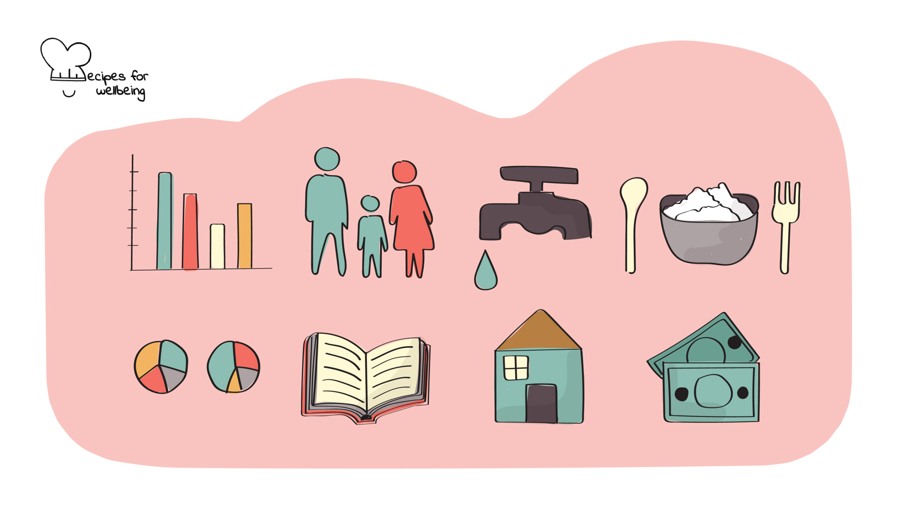
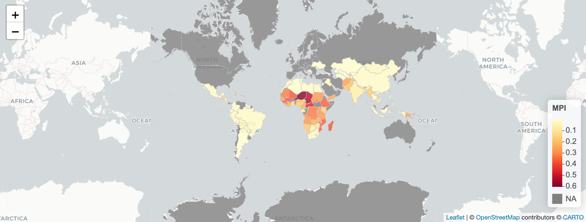
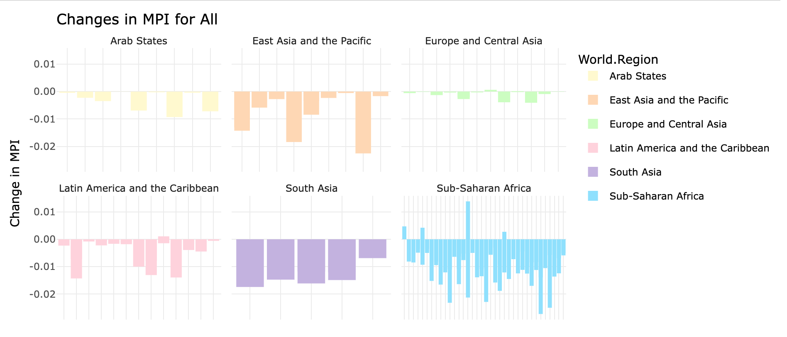

```{r echo = FALSE, fig.width = 8, fig.height = 6, out.width = "100%"}

```


# Introduction
## Background
The United Nations General Assembly established the Sustainable Development Goals (SDGs) in 2015, aiming to create a better and more sustainable future by 2030. The first two goals focus on achieving "no poverty" and "zero hunger” (UN, 2015). However, a series of global crises, including the COVID-19 pandemic, political instability and conflict, and climate change, have slowed progress in tackling poverty. The introduction of global Multidimensional Poverty Index (MPI) in 2010 has provided insights on SDG 1 (no poverty) and at the same time, incorporates indicators relevant to other SDGs. The goal of poverty measurement is to support, motivate, and verify the effective reduction of hardships that afflict people’s lives. By comparing poverty levels across different countries and over time, we can understand the ways and dimensions in which poverty has been alleviated (Alkire, Roche, & Vaz, 2017). The indicators for the calculation of MPI include years of schooling, child school attendance, child mortality, nutrition, electricity, improved drinking water, flooring, cooking fuel, and assets ownership (see Alkire and Robles, 2017). 

## Data Origins
The raw data was taken from OPHI (Oxford Poverty and Human Development Initiative) team for Global MPI from 2010-2023. The dataset consists of 110 countries, with 22 low-income countries, 85 middle-income countries, and 3 high-income countries. The data originates from a variety of household surveys across different countries. The surveys include Multiple Indicator Cluster Surveys (MICS), Demographic and Health Surveys (DHS), and other national surveys tailored for specific countries. The year of the surveys conducted ranges from 2011 to 2021/2022. 

## Research Question
How has MPI changes across the developing countries?

My visualisations aims to look at 
(1) The Multidimensional Poverty Index (MPI) across developing countries based on the most recent data collected.
(2) The changes in Multidimensional Poverty Index (MPI) over the years. 

## Loading Packages
```{r, results = "hide"}
knitr::opts_chunk$set(echo = TRUE, message = FALSE, warning = FALSE)

suppressPackageStartupMessages({
library(readxl)
library(ggplot2)
library(dplyr)
library(plotly)
library(rnaturalearth)
library(rnaturalearthdata)
library(shiny)
library(shinyjs)
library(shinydashboard)
library(shinythemes)
library(leaflet)
library(png)
library(markdown)
})

getwd()


```

# The data
## Importing and cleaning raw data

The first data set focused on the MPI based on the most recent data collected and the second data set includes the MPI collected in two timepoints. 
```{r, tidy=TRUE, results = "hide", tidy.opts=list(width.cutoff=60)}
# Loading the necessary data set and removing rows that are unnecessary
original_data <- read_excel("./MPI/data/mpi_data2023.xlsx", skip = 7)

# Set the threshold for the minimum number of non-NA values required to keep a row
threshold <- 5 

# Create a new data frame, keeping only rows with non-NA counts above the threshold
mpi_data <- original_data[rowSums(!is.na(original_data)) >= threshold,]

# Renaming the columns
names(mpi_data) <- c("ISO Numeric Code", "ISO Country Code", "Country","World Region", "Survey Type", "Year", "MPI", "Headcount Ratio", "Intensity of Deprivation", "Vulnerability to Poverty", "Percentage in Severe Poverty", "Population in MPI Destitute Poverty", "Proportion of MPI poor", "Inequality among the Poor", "Year of the Survey", "Population 2020", "Population 2021", "Year of the Survey for MPI Poor", "Population 2020 for MPI Poor", "Population 2021 for MPI Poor", "Number of Indicators", "Missing Indicator")

# Saving the refined data as a CSV file
write.csv(mpi_data, "./MPI/data/mpi_data2023.csv", row.names = FALSE)

# Importing and cleaning second data set
mpitime_data <- read_excel("./MPI/data/mpi_data_overtime.xlsx", 
                           sheet = "6.1 Harmonised MPI",
                           skip = 7, 
                           range = cell_cols(c("C", "D", "I", "K")))

threshold <- 8

mpi_time <- mpitime_data[rowSums(!is.na(mpitime_data)) >= threshold, ]

names(mpi_time) <- c("Country", "World Region", "Survey Type", "t0", "Survey Type", "t1", "t0 MPI", "t1 MPI", "Change in MPI")

write.csv(mpi_time, "./MPI/data/mpi_data_overtime.csv", row.names = FALSE)

mpi_time <- read.csv("./MPI/data/mpi_data_overtime.csv")

```

# Data Preparation
For the preparation of data for visualisation, I have loaded the "rnaturalearth" package as shown earlier. The package will allow me to create a world map showing MPI across different countries. To merge my data with the world map data loaded, I have changed some countries' names to match them. 
```{r, tidy=TRUE, results = "hide", tidy.opts=list(width.cutoff=60)}

mpi_data <- read.csv("./MPI/data/mpi_data2023.csv")
# View the initial structure and content
str(mpi_data)
head(mpi_data)
summary(mpi_data)

world_map <- ne_countries(scale = "medium", returnclass = "sf")

# Prepare MPI data: ensure country names match in the world dataset
mpi_data$Country <- gsub("Congo, Democratic Republic of the", "Democratic Republic of the Congo", mpi_data$Country)
mpi_data$Country <- gsub("eSwatini", "Kingdom of eSwatini", mpi_data$Country)
mpi_data$Country <- gsub("Gambia", "The Gambia", mpi_data$Country)
mpi_data$Country <- gsub("Palestine, State of", "Palestine", mpi_data$Country)
mpi_data$Country <- gsub("Sao Tome and Principe", "São Tomé and Principe", mpi_data$Country)
mpi_data$Country <- gsub("Viet Nam", "Vietnam", mpi_data$Country)

# Merging both data frames together	
world_data <- merge(world_map, mpi_data, by.x = "name_long", by.y = "Country", all.x = TRUE)

# Removing unwanted data
world_data <- select(world_data, "name_long", "World.Region", "Year", "MPI", "Population.2021")

# Viewing the first few rows of data
head(world_data)
```

## Data Visualisation
```{r, tidy=TRUE, tidy.opts=list(width.cutoff=60)}

ui <- dashboardPage(
  dashboardHeader(title = "MPI in Developing Countries", titleWidth = 400),
  dashboardSidebar(
    sidebarMenu(
      # Set the names for different tabs
      menuItem("Introduction", tabName = "background", icon = icon("info-circle")),
      menuItem("MPI Map", tabName = "mpi_map", icon = icon("globe")),
      menuItem("MPI Changes Over Time", tabName = "mpi_changes", icon = icon("bar-chart")),
      menuItem("Interpretations", tabName = "interpretations", icon = icon("file-alt"))
    )
  ),
  # Include all the necessary contents
  dashboardBody(
    tabItems(
      # First tab content
      tabItem(tabName = "background",
              includeMarkdown("./MPI/background.Rmd")),
      # Second tab content
      tabItem(tabName = "mpi_map",
              fluidRow(
                box(selectInput("region", "Select World Region:",
                                choices = c("All", sort(unique(na.omit(world_data$World.Region))))),
                    width = 3),
                box(leafletOutput("map", height = "500px"), width = 9))),
      # Third tab content
      tabItem(tabName = "mpi_changes",
              fluidRow(
                box(helpText("Select a world region to view the changes in MPI."),
                    selectInput("regionInput", "Select a Region:", 
                                choices = c("All", sort(unique(na.omit(mpi_time$`World.Region`))))),
                    width = 3),
                box(plotlyOutput("mpiPlot", height = "500px"), width = 9))),
      # Forth tab content
      tabItem(tabName = "interpretations",
              includeMarkdown("./MPI/summary.Rmd"))
    )
  )
)

# Starts the visualisation by introducing the definition of the server function for Shiny
server <- function(input, output) {
  # Creates a color palette for better visualisation
  color_palette <- colorNumeric(palette = "YlOrRd", domain = world_data$MPI)
  # Output for the interactive map
  output$map <- renderLeaflet({
    # Filters world_data based on the World.Region selected
    filtered <- if (input$region != "All") {
      filter(world_data, World.Region == input$region)
    } else {
      world_data} 
    
    leaflet(data = filtered) %>%
      # Adjust these values to set the initial view
      setView(lng = 0, lat = 0, zoom = 1) %>%
      addProviderTiles(providers$CartoDB.Positron) %>%
      addPolygons(
        fillColor = ~color_palette(MPI),
        fillOpacity = 0.8,
        color = "#BDBDC3",
        weight = 1,
        popup = ~paste(name_long,
                       "<br>", "MPI:", MPI,
                       "<br>", "Population 2021:", Population.2021,
                       "<br>", "Year Data Collected:", Year)
      ) %>%
      addLegend("bottomright", pal = color_palette, values = ~MPI, title = "MPI", opacity = 1)
  })
  
  # Ouput for the bar graphs showing the changes in MPI
  output$mpiPlot <- renderPlotly({
    filtered_data <- mpi_time
    if (input$regionInput != "All") {
      filtered_data <- mpi_time[mpi_time$`World.Region` == input$regionInput, ]
    }
    #Setting different colors for each region
    color_mapping <- c("Arab States" = "#fffacd", 
                       "East Asia and the Pacific" = "#ffd8b1",
                       "Europe and Central Asia" = "#caffbf", 
                       "Latin America and the Caribbean" = "#ffd1dc", 
                       "South Asia" = "#c3b1e1", 
                       "Sub-Saharan Africa" = "#8be0fe")
    
    p <- ggplot(filtered_data, aes(x = Country, y = `Change.in.MPI`, fill = `World.Region`)) +
      geom_bar(stat = "identity", position = position_dodge()) +
      scale_fill_manual(values = color_mapping) +
      theme_minimal() +
      labs(title = paste("Changes in MPI for", input$regionInput), 
           x = "Country", 
           y = "Change in MPI") +
      facet_wrap(~`World.Region`, scales = "free_x") +
      theme(axis.text.x = element_text(angle = 45, hjust =1))
    
    if(input$regionInput == "All"){
      # Removes the country names when "All" is selected
      p <- p + theme(axis.text.x = element_blank(), axis.ticks.x = element_blank()) +
        labs(x = NULL)}
    
    ggplotly(p)
  })
}

shinyApp(ui = ui, server = server)

```


## Visualisation 1
This visualisation is a static image of Multidimensional Poverty Index (MPI) in 110 developing countries. 


```{r echo = FALSE, fig.width = 8, fig.height = 6, out.width = "100%"}

```

## Visualisation 2
This visualisation aims to compare the changes in MPI across different countries between two time points at which the data was collected and calculated.

```{r echo = FALSE, fig.width = 8, fig.height = 6, out.width = "100%"}



```

# Interpretations 

The map shows that the countries in the Sub-Saharan Africa have the highest MPI as compared to the other developing countries. This indicates that among all the developing countries, more focus has to be placed on Sub-Saharan Africa if the United Nations aim to achieve "no poverty" by 2030. 
From the bar graphs showing changes in MPI between two data points, we can conclude that most of the developing countries have made progress in reducing multidimensional poverty. The region Sub-Saharan Africa has indicated a trend of improving conditions over the represented periods although there are some countries showing an increase in MPI over the years. 
By looking at both visualisations together, we can derive that most developing countries have made an attempt to resolve their poverty and they are coming to a success. 

# Limitations and Future Directions

Despite the first dataset being labeled "The Global Multidimensional Poverty Index 2023," the OPHI dataset contains no data from 2023, only spanning from 2012 to 2022. This mismatch may not reflect current poverty levels accurately, potentially skewing analyses and making it difficult to address recent shifts in socio-economic conditions effectively.

For the second dataset, The MPI data was collected inconsistently across different years for each country, as shown in the cleaned dataset. This irregular collection schedule complicates comparisons of annual MPI changes and may overlook fluctuations due to data gaps, hindering reliable trend analysis.

To align better with the United Nations' SDG Goal 1 (No Poverty) and enhance global development efforts, increasing the regularity and frequency of MPI data collection is crucial. More current data will facilitate more effective monitoring and timely policy adjustments.

# Summary

I have recently explored the Shiny App, which is excellent for creating interactive visualizations. In addition, I have expanded my skills in R and GitHub. I have learned that even minor errors, like misspellings or misplaced code, can lead to significant discrepancies or less visually appealing graphs.

Given more time and data, I had like to develop another visualisation focused on the SDGs, examining how each goal contributes significantly to addressing various challenges in achieving a sustainable world and how they correlate with the MPI. 


# References

Alkire, S., Roche, J. M., & Vaz, A. (2017). Changes over time in multidimensional poverty: Methodology and results for 34 countries. World Development, 94, 232-249.

Alkire, S., & Robles, G. (2017). Multidimensional poverty index summer 2017: Brief methodological note and results. OPHI Methodological Notes, 45.

Oxford Poverty and Human Development Initiative (OPHI), & United Nations Development Programme (UNDP). (2023). Unstacking global poverty: Data for high-impact action. United Nations Development Programme and Oxford Poverty and Human Development Initiative.

United Nations. (2015). Transforming our world: The 2030 Agenda for Sustainable Development. Department of Economic and Social Affairs: Sustainable Development. Retrieved from https://sdgs.un.org/2030agenda


